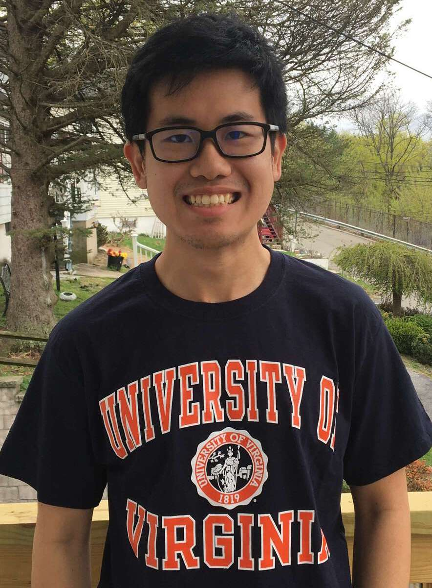

## About Me

::: {.columns}

::: {.column width="70%"}

I am a sixth-year PhD candidate in Mathematics at the University of Virginia,
working under the supervision of [Jennifer Morse](https://morsej123.github.io/).

I expect to complete my PhD in May 2027 and am currently seeking postdoctoral
positions beginning in Fall 2027.

I received my B.S. in Mathematics from Lehigh University in 2021.

My research interests lie in algebraic combinatorics, particularly in the
study of modified Macdonald polynomials, Catalan functions, $k$-Schur functions,
and $k$-shapes.

I was born in Bangkok, Thailand, and moved to the United States at age 18.
Outside of mathematics, I enjoy exploring food from different cultures,
singing and music, studying technical analysis in financial markets, chess,
and playing the mobile game *Last War*.

:::

::: {.column width="30%"}

{width=90%}

:::

:::

For more information, please see:

- [Curriculum Vitae (PDF)](cv.pdf)
- [Research Statement (PDF)](research-statement.pdf)

*CV last updated: July 2026*

## Contact

**Office:**  
Kerchof Hall 114  
University of Virginia

**Email:**  
guc8ns@virginia.edu

**Pronouns:**  
He/Him/His

## Papers, Publications, and Preprints

### Paper Title

**Authors:** Suchakree Petch Chueluecha, Collaborator Name

Description of the paper and its main contributions.

[arXiv Link](#)  
[Journal Link](#)

## Conference and Workshop Participation

### Formal Power Series and Algebraic Combinatorics (FPSAC)

**University of Washington, Seattle**  
July 13–17, 2026

**May 2026**

Presented a talk on:

> Presentation title goes here.

## Teaching

### University of Virginia

#### Instructor / Teaching Assistant

Course Name  
Semester Year

- Developed course materials and examples.
- Led discussions and problem-solving sessions.
- Supported students in understanding mathematical concepts.

---

## Awards and Honors

- International Mathematical Olympiad (IMO) Bronze Medal
- Additional mathematics competition achievements
